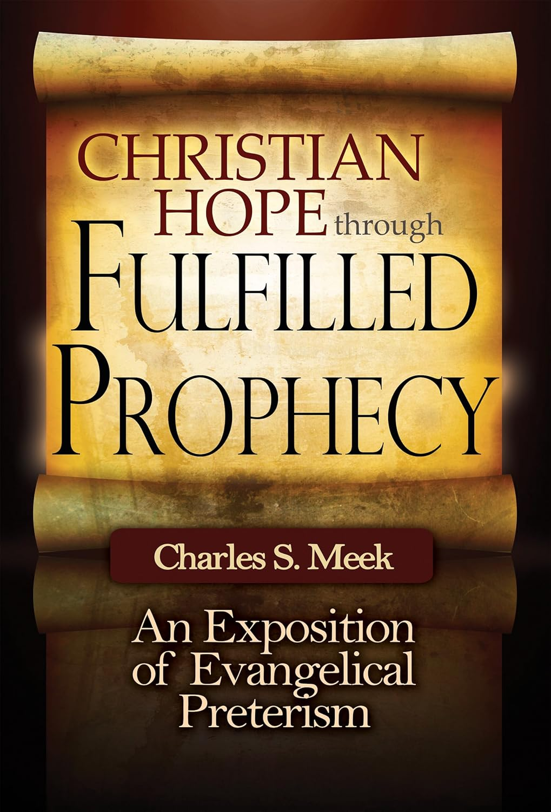

I'm going to front load my central thought about *Christian Hope Through Fulfilled Prophecy*: it is not primarily a book about eschatology; it is primarily an apologetics argument. It is all about making sure that Jesus, and other biblical authors, were not wrong when they made claims of imminency for things like the parousia and the end of the age. That isn't necessarily a bad thing, and the author is clear about that purpose, but based on the title you might be coming in looking for something else.

## The Argument

To summarize author Charles Meek's full preterist view as succinctly as I can:

- "The end of the age" and similar language we usually assume means the ends of all physical existence was referring to the end of the Old Covenant age that came about with the destruction of Jerusalem in 70 C.E.
- The second coming of Jesus, the parousia, also happened at 70 C.E.
- Salvation was not complete until 70 C.E. I got a bit lost on why destroying the Temple was necessary on top of the life, death, and resurrection of Jesus.
- People of faith before 70 C.E. were resurrected to Heaven in 70 C.E., having been asleep since their death.
- People who die after 70 C.E. go immediately to be judged upon death.
- We have been in the New Earth since 70 C.E. and it will never end, instead offering a perpetual supply of people who can populate Heaven upon making decisions of faith.

## What I Liked

Meek regularly made a point of calling out evangelicals who say they only believe what the Bible says but have fantastical eschatologies and no idea how to answer imminency texts.

He took the biblical text seriously.

He tackled complex ideas in words that intelligent lay people could understand.

It's a good reminder that the old covenant age is over.

It's a good reminder that the Bible was written _for_ everyone, but not _to_ everyone. Context matters in interpretation.

The description of dispensationalism near the end was very helpful.

It is internally consistent, as far as I could tell without really looking up every passage.

## Differing Assumptions

On to the meat of the discussion, most of which are different assumptions between us rather than total holes in the argument:

One assumption Meek needed to make for this to all work is for every book of the Bible with an imminency text to have been written before 70 C.E. Otherwise, when the authors said the end of the age was coming soon, they were still wrong. With the purpose of the book being to prove the inerrancy of these prophecies, the whole book's argument would implode without that assumption. He doesn't really spend long trying to defend why every book was written before 70 C.E. except to say that some scholars think they were. Lots of other scholars disagree, though, at least for some texts.

Another differing assumption is our reading of Revelation. To me, Revelation is an apocalyptic demonstration of how Jesus defeats evil through his nonviolent sacrifice. While I found Meek's argument convincing that it was written during the persecution (Tribulation) of Nero rather than Domitian - those are the two main options that scholars narrow it down to - he casually dismissed any spiritualist readings to only talk about literal history, past or present, as the purpose. I would tend to believe that Revelation was speaking to a particular tribulation but is encouragement that Jesus' followers can apply to any tribulation because we know Jesus has triumphed over evil. Meek's system did not do an adequate job explaining how evil can still exist - he was very insistent that Jesus' victory was complete and Satan was vanquished, so all evil must be human free will. It transplanted Revelation's usefulness and hope from today into the past, and came across very privileged to dismiss evil so easily.

Meek is a cessationist, using the argument that the charismatic gifts existed during the overlapping period of old and new covenants. Once the old was defeated along with Satan, the gifts were no longer necessary. I don't know why they would no longer be necessary, since it seems like the gifts would be more directly tied to the new than the old. There didn't seem to be any active role for the Holy Spirit for Christians today.

In some areas, like his distinction between the New Heaven and New Earth, Meek was definitely more dualist than I would be. Earth matters to Meek because that's where we make decisions whether to accept Jesus or not, but it and our bodies are really just a stepping stone to get to Heaven.

My biggest problem was with tying the parousia to the destruction of the Jerusalem Temple. For Meek, Jesus' role in coming again was destruction, not offering restoration in any way. Meek didn't dismiss that Jesus offered redemption, but that was all in the first coming. Logically consistent, maybe, but it doesn't sit right with me that Jesus would be that different than the first time. If anything, it fits my understanding of Jesus much better to see Pentecost as the parousia - restoring humanity and being with us always - but that was before most of the imminency texts so it wouldn't solve the apologetics problem.

In short, as with many theological questions, it really boils down to "what is God like?" I picture God first through the life of Jesus, then the rest of Scripture through that lens. I conclude that the struggle against evil is one that Jesus invites us all into. I conclude that God's judgement is about restoring rather than destroying. I conclude that God cares about this Earth, more than just a stepping stone. I just can't make the God I see in Jesus fit a few elements of this system which Meek lays out.

## Conclusion

The title was _Christian Hope Through Fulfilled Prophecy_. Most of why this gives us hope, though, is because Jesus (and others) were right when they used imminency language. Meek's hope is in the truth of inerrant prophecy, while I feel more comfortable saying my hope is in Jesus regardless of what imminency texts meant. Other than that, I'm not convinced Meek's full preterism is any more hopeful.

_Disclosure of Material Connection: I received this book free from the author and/or publisher through the Speakeasy blogging book review network. I was not required to write a positive review. The opinions I have expressed are my own. I am disclosing this in accordance with the Federal Trade Commission’s 16 CFR,Part 255._
