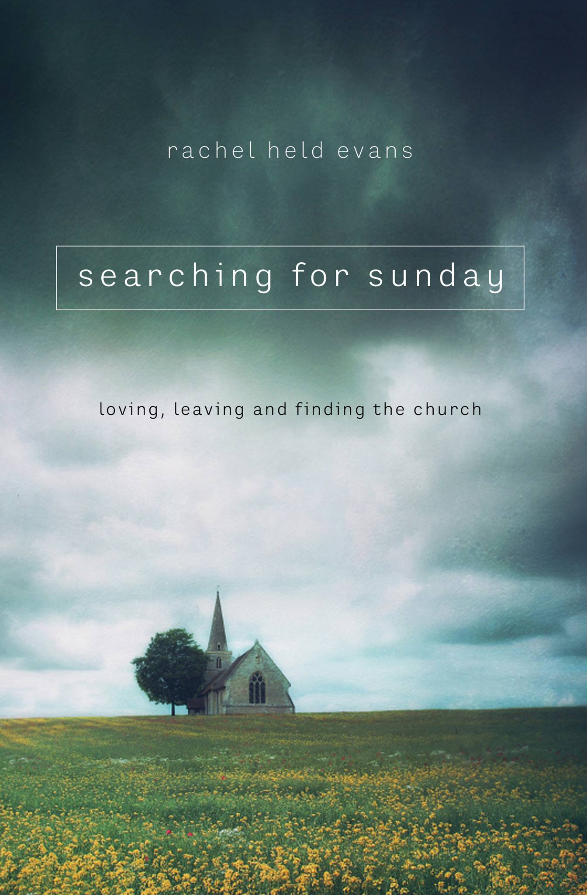

_Searching for Sunday_ is Rachel Held Evans' best book yet. The main reason for that is because it is full of hope. _A Year of Biblical Womanhood_ was a fantastic analysis of various biblical texts along with a fun engagement of how many different ways genuine Christians (and Jews) interpret those texts. _Faith Unraveled_ (previously _Evolving in Monkey Town_) was very easy for so many to relate to, discussing her departure from conservative Evangelicalism into a world with a lot more questions. Those are definitely valuable, but they are by far the most valuable when those steps in the journey bring you to something more like _Searching for Sunday_. It's a mature faith that has wrestled through many questions and reached answers with a sense of humility intact.

Since I've already spent time responding to each section, I'll just give some short notes of other positives and negatives about the book to wrap this up.

### Positives

The writing style is beautiful, as usual for Rachel's books. When I first read one of her books (Biblical Womanhood), I sort of expected it to read like an extended blog post, but was surprised at the depth of the language used. This book is much less intellectual but is far deeper with her language.

I love the honesty with failure - her own and others - without dwelling in shame of it. We need confession as it helps guide us to something better, which is exactly what Rachel does. Many other speakers and writers would either settle for wallowing in shame or brushing off any hint of problems in life. People are broken image bearers of God - we can acknowledge when brokenness comes out to try to fix it, but remember who we are at the core.

On a related note, she is incredibly gracious toward her "enemies." I think of how she describes her old church: a group of loving people who she just couldn't agree with on many things anymore. I have a hard time thinking of hard complementarians as "loving people" and just boil it down to a disagreement, although I do think some forms of complementarianism can be free of direct harm. When people question my salvation because I believe God used evolution in creating the world, I generally don't rush to assume the best of them. Rachel does that very well.

I love the glimpses we get into Rachel and Dan's relationship. The way they worked through so many things together is amazing. It's not a book about marriage, other than the last section, but their healthy marriage does stand out.

### Negative

My biggest negative of the book I think is the structuring around the 7 sacraments. For some sections, the themes she discussed were really obvious and that made the imagery powerful; baptism and communion stand out as two particularly powerful sections to me. Others felt more like she was stretching, like confirmation. There may have still been more gained with this structure than lost, but it did stand out as a distraction sometimes when I was trying to draw the connection all through the section instead of maybe focusing as much on what she was actually saying.
