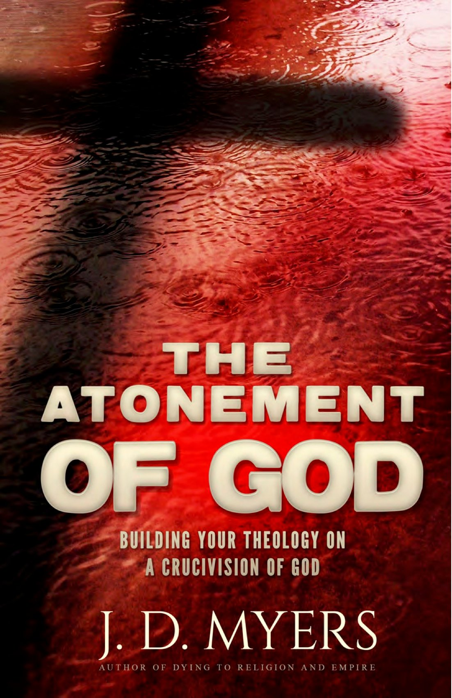

A few years ago I was strongly considering writing a book. My premise was essentially a systematic theology but starting with the idea that God looks like Jesus, particularly when it comes to rejection of violence. *The Atonement of God* by J.D. Myers is the closest I've encountered to trying for the same goal, with a couple of significant differences:

- It is not nearly as comprehensive as a systematic theology, sticking to topics that are directly related to a non-violent understanding of the atonement.
- The starting point is a non-violent understanding of the atonement in particular, rather than a non-violent God in general.

Maybe that excitement biased me, but I felt like the book was only moderately successful.

### Style

My main complaints are related to the style, not the content. It feels sloppily written. It often gets very repetitive, which meant that although it was a short book, it probably could have been half the size. It doesn't really do a good job explaining what is meant by some terms, such as pacifism (see below). It uses gendered language, and I don't just mean some that are very understandable like male pronouns for God - I mean regularly using "man" to mean humanity. If this was written 50 years ago or even 20 years, that wouldn't bother me, but at some point if you're writing a book about a non-violent God, you should stop and think about whether your language is cutting out half of the image of the God.

### Content

When it comes to content, I'm less critical. The strength of the book is when he explains his understanding of a non-violent atonement. I have read a few of these in recent years, most notably J. Denny Weaver's *The Nonviolent Atonement.*

#### Christus Victor

The best part of the book is explaining how in this theory he understands Jesus defeated Satan, sin, and death. At risk of oversimplification:

Jesus defeated sin in that we no longer need to be afraid and ashamed when we sin, knowing God loves us regardless. We are free from the lie that God is separated from us because of sin.

Jesus defeated Satan. Satan is the Hebrew word for accuser. Satan is the one who is always playing the judgemental card, claiming we can't truly be loved by God because we aren't good enough. This part wasn't new to me, but is very important to remember this shame should be rejected as from Satan, not embraced as from God.

Jesus' defeat of death was the most fascinating as well as new to me. Myers argued that when the Bible talks about being slaves to death before Jesus freed us, it isn't talking about our own death. Obviously we still die, although most Christians would believe that some day we will not. Instead, Myers argues that Jesus frees us from being enslaved to the death of others - the scapegoat impulse that requires us to kill others in order to feel better about ourselves.

This began with Cain killing Abel. Myers offered a good insight for why God would reject Cain's offering. Cain probably grew up hearing the promise to his mother that one of her children would crush the serpent and restore human life to the Garden of Eden. He likely had it in his mind that it was his job to repay God for the fruit his parents ate, in order to win back God's love. The problem was that God never stopped loving him. Cain believed a lie and that caused him to create religion, in the worst sense of the word, and God rejected it to say it was not necessary. Abel made a sacrifice, but it was without this desire to win over God, so it was accepted. Cain then got angry at his brother and committed the first murder. When God explains the consequences to Cain, it is Cain who adds separation from God to the list, seeing it as punishment rather than consequence.

#### Peace

The last chapter unfortunately soured the book for me a little. Myers claims that it is a discussion of the idea of peace as seen through the non-violent atonement. He immediately states that he is not a pacifist and doesn't think we should be. He never explains what he means by pacifism, although he seems to think it means being passive. This is another case where a stronger editor would have been helpful.

But that wasn't the biggest problem with this section. The heart of the chapter was that the key to peace is accepting blame, to see ourselves as the enemy. In many cases I do not disagree. Taking responsibility for our own actions is essential to making peace. There's that phrase "love means never having to say you're sorry." That is a terrible idea. Love means being quick to say you're sorry for the good of the other person, rather than holding on to your pride or shame. But I do think Myers goes too far, saying things like that everybody is always partly to blame for a conflict. He even argues that God was partly to blame for the existence of sin by virtue of giving us free will and the cross was God accepting his true blame. That seems like a stretch to me and I think it is much more powerful (and accurate) to say that God took our punishment even though completely innocent, a true scapegoat.

Where it becomes a problem, though, is the reality that not all violence is a two-way problem. What does this say to a woman being abused by her partner on a daily basis? According to Myers, she should reflect on how she is really the enemy and has "contributed to the anger and hostility and violence directed toward \[her\]" (155). That's the recipe for perpetual abuse, which I do not for a second think is what Jesus wants. After he rejects pacifism, seemingly because he thought it was the same as being passive, he then goes on to say that we should be mostly passive rather than actively pacifying the violence.

We should definitely examine ourselves and open ourselves to vulnerable critique from others we trust. We should be quick to apologize and repent if we have contributed to the violence of the situation. But sometimes there really are victims in a situation and I strongly disagree with telling those victims to contemplate their sin until it gets better. That creates another scapegoat, which Jesus came to end, not peace.

_Disclosure: I received this book from Speakeasy in exchange for a fair review._
