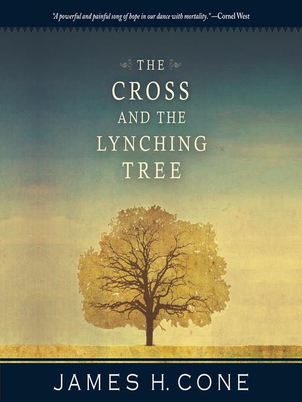

This is an older sermon from 2018 that I am just now posting in 2025, and I did initially have a slideshow with accompanying photos. I don't have that anymore, so I can't easily piece together what those photos were in order to share them. I did my best, and smoothed over the wording in some other places.

## Texts

[Confession of Faith](https://www.mennonitechurch.ca/cof), Article 4.

[2 Timothy 3:14-17](https://bibles.org/bible/1fd99b0d5841e19b-02/2TI.3?passageId=2TI.3.14-2TI.3.17&q=2%20Timothy%203%3A14-17).

## Transcript

### Intro: An Embarrassing Book

When Ann introduced this confession of faith series back in January, she mentioned how she was embarrassed by some parts of the confession of faith (Ann helped write it and spoke about that experience). All I could think about at the time was "crap, I just signed up to talk about the Bible." If the confession is embarrassing, just wait until we read what the bible has to say sometimes. And with the confession we can at least always say that it was just humans who wrote it. With the Bible, we’re claiming that all this embarrassing and often extremely problematic content was breathed out by God.

I’m convinced that if somebody simply rewrote books of the Bible in modern language and published it under a different name, most Christian bookstores would refuse to carry it because of all the violence and sex and sometimes swearing. Game of Thrones would be tame in comparison.

We definitely wouldn’t be marketing that book for kids, like this one, my first Bible, the "Kid’s Application Bible". I got this for Christmas when I was 7 from my grandparents. Somebody probably did tell me that I should not start at the beginning like any other book, but I did anyway. I can remember at least getting past Judges so that would have meant a lot of interesting stories. God murders almost the entire world in a flood. God commands a child sacrifice. God turns a woman into salt for daring to look back at her town that God was destroying. God crashes down the walls of Jericho onto all the civilians other than Rahab, the prostitute, and her family who were spared because the Israelite spies decided to, uh, spend the night there before reporting back to Joshua. That’s just the bad stuff attributed to God. There’s also rape, incest, slavery, prostitution, the rest of Israel killing all the men of the tribe of Benjamin, and oh so much more. Introducing kids to the Bible is fantastic and important, and I did get a lot of guidance from my church and family- they didn’t just leave me to figure this out on my own - but we can’t simply pretend all this stuff isn’t there.

### Avoiding Extremes

The modern Christian Church has tended to fall toward one of two extremes in response to this messiness in the Bible.

One solution is essentially denial, pretending that those messy parts don’t exist or that they aren’t a problem. For example, they may argue that the genocide of the Canaanites was completely ethical because God said it. Case closed. Ask them about that other part in the Bible when God said to love your enemies and they’ll mostly just shrug, not wanting to think too hard about the contradiction.

Often, this takes it far enough that it idolizes the Bible, treats it as if it was God. I had a professor in seminary who I remember talking about how the Catholic Church tended to functionally replace the Holy Spirit with the institutional Church as if it was the third member of the Trinity. Protestants came along and knocked the Church down a peg, but then put the Bible in that place instead. The Eastern Church has tended to be better on that front, keeping the Holy Spirit in place.

I realize there’s some irony in me saying this. We started out this confession of faith series in the order it is in the confession, going through God and Jesus, then we were supposed to do Holy Spirit before moving on to Scripture. That was the week of the ice storm. So, I’m in the odd place where I have sort of done what I am criticizing, but it was entirely by accident and we will get the Holy Spirit week rescheduled I’m sure.

When you treat the Bible as God in this way, it doesn’t take long for "the Bible" to be shorthand for "my tradition’s interpretation of the Bible", but people don’t realize this, so they just yell at each other and divide because those other people don’t even follow the Bible. This might be the most succinct way to summarize 500 years of Protestant history.

To quote the biblical scholar NT Wright, the phrase "authority of Scripture" only makes sense if by that you mean it is shorthand for the authority of God as exercised through Scripture. Scripture in and of itself is not our authority.

[Another comic](https://churchm.ag/denominations/) demonstrates this perfectly. A teacher is showing a chart of all the divisions branching off each other in church history. They point at the bottom and say "so this is where our movement came along and finally got the Bible right" to which the student responds "Jesus is so lucky to have us." I also find it fascinating that this comic refers to getting the Bible right, not to getting Jesus right or God right or Christianity right, which is not far off from language you might see like a "Bible-believing church." You’re already missing the point if you think the goal is to understand the Bible perfectly rather than to follow Jesus.

On the other end, often labelled as liberal, we could acknowledge the messiness of the Bible and conclude therefore that it is irrelevant. In a lot of popular conversation, this is seen as the only other option. Fundamentalist Christians, liberal Christians, and the more extreme new atheists can agree on this: either read the Bible through that propositional lens, or dismiss it entirely.

If those really were the only two options, I would be completely in agreement with this liberal perspective. Fortunately, the modern Western way to read the Bible is not our only option.

### Good Messy

At first glance with our Western lens, a factually-perfect Scripture sounds like it is the highest possible way to think about it. But even if we couldn’t easily poke holes in those factually-messy and ethically-messy parts, this perspective has a bigger problem: it strips out any relationality.

The Bible is messy, but we believe in a messy God, a God who still sees so much value in the broken and flawed. This is a God who cares more about relating to us than about factual perfection, and that shines through when we allow the Bible to be the complicated mess that it is. To me, that is a higher view of Scripture, so much more beautiful than an abstract rulebook.

Another way to frame this is that the Bible is the wrestling mat with God. This phrase goes back to the foundational story when Jacob is given the name Israel after wrestling with God – or possibly an angel, again the Bible isn’t always concerned with factual detail. The name Israel means one who wrestles with God. If we are to be the ones who follow in those spiritual footsteps, we must be willing to wrestle with God as well. The Bible is often a place we can encounter God and do that wrestling.

Here’s one of my favourite examples from Proverbs 26:4-5. In back to back verses, we have completely opposite advice. Don’t answer a fool according to his folly because if you do, you sink to that level. Do answer a fool according to his folly because if not, he’ll think he’s wise. I’ve seen the modern version of this exact debate play out a lot in the past couple of years. If a certain prominent politician repeatedly lies, what should journalists do about it? Is it their job to call out every lie no matter what, or does that just feed the narrative that mass media is fake news? Or do they ignore it, and risk the lies getting even more out of hand? I think in sticking this conflicting advice beside each other, it was like an ancient way for the author to say, "well, it depends, it’s complicated." That might frustrate you if you are looking for a rule book to answer every question about life, but if you are looking for a ground to wrestle with God about questions like this, it’s reassuring that you aren’t alone in trying to navigate these things.

The other reading today from 2 Timothy says that the Bible is God-breathed and I’ve heard many sermons about this part. Some translations just say "inspired" but "God-breathed" is a more direct translation of the Greek text. It’s often used to argue that the Bible is perfect in the modern propositional fact sense, since God is perfect and God wouldn’t breathe something imperfect. But there’s another thing the Bible says has been breathed by God: us, humanity. The Bible describes itself with the same language it describes us: messy, flawed, but still a place we can see God.

### Using the Bible

Within the context, the author of 2 Timothy seems more concerned with the claim that the Bible is useful, though. It is not an extravagant claim of precisely how much was God involved in getting the Bible to how it is today. Some of those questions are interesting to talk about and do have implications for how we interpret what we read in the Bible, but the main priority of the biblical authors seemed to be that we use it in ways that help us follow Jesus better.

### The Jesus Lens

So on that note, if we were talking how to use this book that is useful, the first thing we have to say is Jesus. Jesus is always a good answer. I had a youth pastor who joked that most of the pre-written questions for kids could be answered with one of "God, Jesus, Holy Spirit, Bible." With Anabaptists that’s especially true with Jesus.

The modern framework in most biblical studies classes will emphasize getting as close as we can to understanding the intention of the author in their context. This is a noble and useful thing. But the Bible writers don’t even use their own Scriptures in this way. They repeatedly take some very creative liberties with their sacred texts, twisting things all over the place to make something which clearly meant something else to the original author to now be about Jesus. For a long time, I used those Bibles which had footnotes where the author was quoting or citing a previous text. Like most people I imagine, I never went back and read the context of those original texts. I just assumed that if it was in the Bible, it was all completely consistent. And from their perspective it was all consistent, just not from a modern perspective.

One of many examples: Matthew quotes Hosea about God calling his son out of Egypt. In Hosea it is very clear that is referring to the nation of Israel in the Exodus story, while Matthew spins it to be about Jesus as a child refugee. This was not a conflict for Matthew.

Jesus gives them and us permission to do this. He says things like "you search the Scriptures because you think that in them you’ll find eternal life, but they point to me" in John 5 and that he fulfills the Scriptures in the Sermon on the Mount. Jesus seems to think that we are supposed to read the Bible looking for him.

Oh, and even Jesus did this twisting with his own teaching. In Luke 4, when he launches his ministry, he reads from Isaiah. He says:

"The Spirit of the Lord is on me, because he has anointed me to proclaim good news to the poor. He has sent me to proclaim freedom for the prisoners and recovery of sight for the blind, to set the oppressed free, to proclaim the year of the Lord’s favour."

Then he rolled up the scroll and stopped. If you look up the reference in Isaiah, he stopped partway through a sentence. The next line is "and the day of vengeance of our God." His listeners are longing for somebody to come along and get rid of their Roman oppressors with that day of God’s vengeance. That would be the good part they were looking forward to hearing preached. And Jesus just cuts that part out. He twists Scripture out of its obvious context to point us toward a better picture of the heart of God.

Understanding the original context and intent of the author is good and helpful to better understand the text, so I don’t want to come across too harsh as slandering modern biblical studies. But it is not the end goal. We do not have to say that the only value in a text is whatever the author originally meant. If we believe that Jesus is the ultimate revelation of God – which goes back to last time I preached – then it makes sense that the Bible would point us back toward him.

This isn’t a pointing in some legalistic or literal way. We don’t have to pretend that every verse void of context is actually about Jesus. Rather, Jesus is the culmination of the story of the Bible. Some would read the Bible as if it were flat – all texts being equal – but that’s not how a story works. If you watch a movie with a great twist ending, it is going to force you to reinterpret everything that came before it. The classic example is the Sixth Sense. You can’t learn at the end that Bruce Willis was dead the whole time, then still insist that he was alive for most of it. It’s an old movie; I do not need to give a spoiler warning for that. You didn’t know he was dead the whole time, but now you do. In the same way, now we know how the story builds through Israel to Jesus and the Church, so we can’t just go back to pretending otherwise.

### Community

How to do this Jesus lens isn’t always obvious, of course. It is easy to all have our own image of Jesus and then twist the rest of Scripture to fit that image.

One important check against this is a community hermeneutic, simply meaning that we read Scripture together. I sometimes think I’m pretty knowledgeable about the Bible. After all, I have a Master of Divinity, which has to be the most arrogant sounding degree possible. If I’m a master of God, what can mere mortals teach me about the Bible? Well, turns out, there’s a lot.

The 2 Timothy text even hints at this a bit, which I hadn’t noticed before now, when it says: "because you know those from whom you learned it". The author doesn’t expect Timothy to just accept this because it was in an important magical book, but because it came out of learning together in relationship.

Community in general doesn’t go far enough, though. That same professor I mentioned earlier had another line I often think about. She pointed out that if we just say "theology", we are talking about straight, white, European or European-descended, men. Probably German but sometimes American, and usually Protestant. Everything else gets an adjective. Black theology. Feminist theology. Womanist theology. And so on. This is a simple way that we might allow marginalized groups to speak on theology, but we also make sure it is clear that the real objective theology is when people like me do it.

So, especially if you are somebody like me who has a relatively high amount of privilege, it is absolutely vital that we learn to listen to those who don’t. There are obviously lots of reasons to do this simply in terms of being able to love our neighbours better, but it’s also true that we’re going to miss a lot of the Bible if we don’t.

A simple example is the story of Junia. In Romans 16:7, Paul refers to Junia as prominent among the apostles. After a couple of centuries, manuscripts began changing the name from Junia – a woman’s name – to Junias, a man’s name. It was likely not an intentional conspiracy to get rid of Junia, but by the 3rd century there were few women in leadership in the church. These male manuscript copiers probably assumed that their manuscripts had a simple error and so they went ahead and fixed it. Most translations have now fixed this back, but to this day we still have some printing the incorrect Junias.

Another example would be the Exodus story. Growing up, the primary point of the story always came across to me as how much more powerful God is than the gods of Egypt. That’s in there. But the thrust of the story is that God heard the cries of an oppressed people and came to their rescue.

The Bible was written by a tiny nation spending most of its time under the oppressive boot of one Empire or another: Egypt, Assyria, Persia, Greece, Rome. If I read the Bible by myself, I share a lot more in common with these Empires than I do with any of the biblical writers.  If only people like me did theology and biblical studies, it would become very easy for me to not even notice the ways that the Bible opposes these Empires and empowers women and cares for the poor and so on. Here’s another one of my Bibles: the Poverty and Justice Bible, which highlights texts that have to do with poverty and social justice. It really helps make it obvious when a significant portion of the text is highlighted, but still I would need some of those other voices to help me grasp what is going on.

### Conclusion

[One of my favourite comics, XKCD, recently released this one](https://xkcd.com/1984/). One person is sitting at a computer and says "Ugh, people are mad at me again because they don’t read carefully. I’m being perfectly clear, it’s not my fault if everyone misinterprets what I say." Another person outside of the frame responds, "Wow, sounds like you’re great at communicating, an activity that famously involves just one person." Communication is messy, even when it is between two human beings who share a lot in common, let alone from God to us.

The Bible is messy and it isn’t always easy to figure out how to read it in a healthy way. But my hope is that we can embrace that beautiful mess and use it, together in community and always with an eye toward Jesus.
